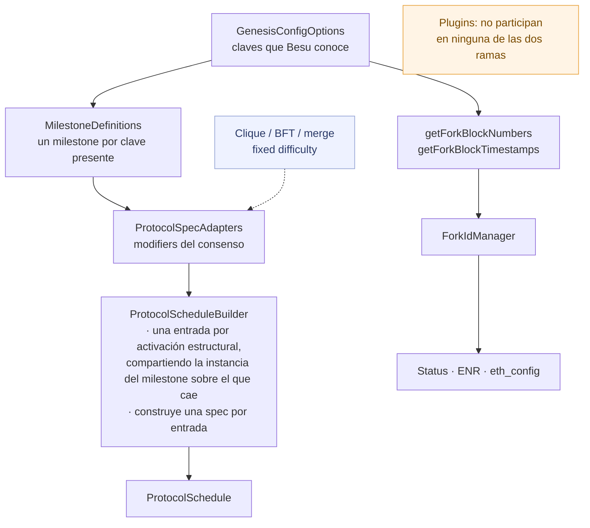
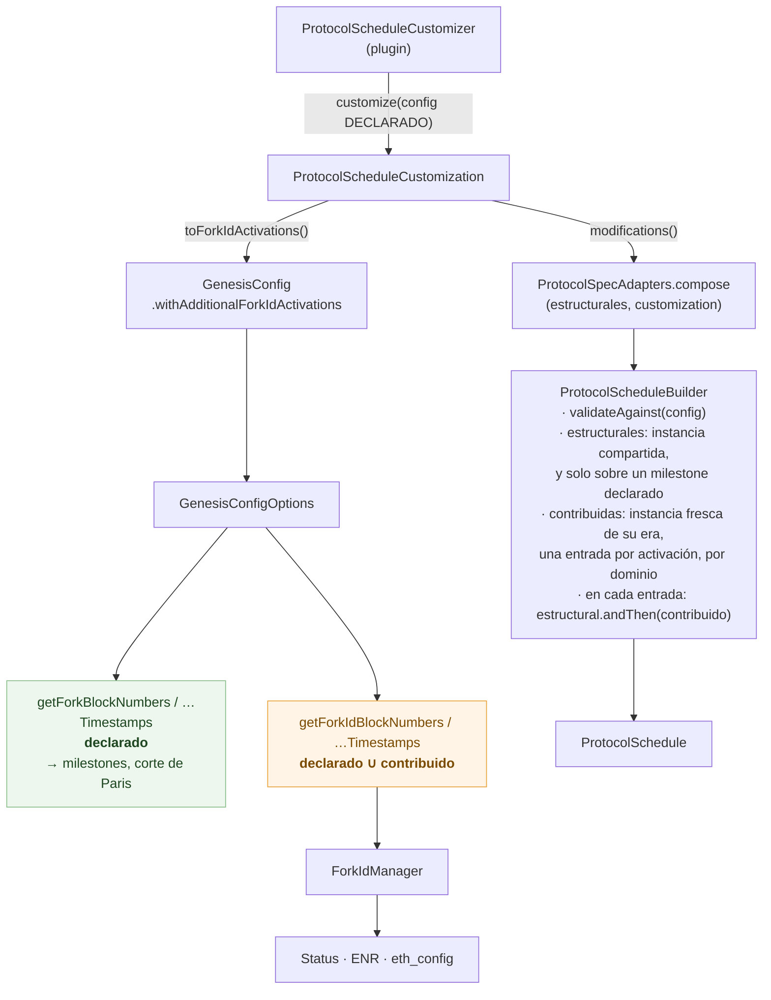
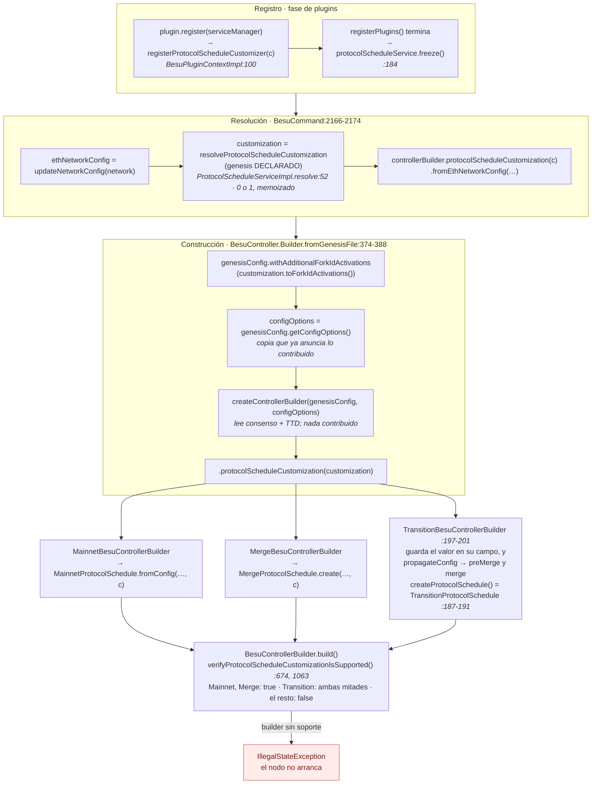
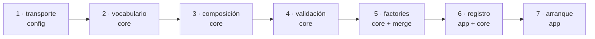

# Protocol schedule customization en Besu

> Rama `pr/protocol-schedule-customization`: 7 commits sobre `b330564a94` (un commit real de
> upstream/main), 38 archivos, +2394/−69 —1194 líneas de producción y 1199 de tests—. Hashes en
> orden: `98874f8b17` → `a65156acaf` → `a2456846a8` → `58af784e86` → `e708f69ff1` → `c7e518f56f`
> → `bb20b8d442`. Escrito leyendo el diff completo, los mensajes de commit, los tests, el código
> preexistente del que el diseño depende y el plugin de ETC que lo consume. No se corrió ningún
> suite. Las líneas citadas son del estado final de la rama.

## 1. Panorama

### 1.1 El problema, con el caso que lo motiva

Besu arma el protocol schedule a partir de las claves de génesis que él mismo define
(`homesteadBlock`, `byzantiumBlock`, `shanghaiTime`, …). `MilestoneDefinitions` convierte cada clave
presente en un milestone con su `ProtocolSpecBuilder`; el mecanismo de consenso —Clique, BFT, merge,
dificultad fija— adapta esos builders con *modifiers* propios a través de `ProtocolSpecAdapters`;
`ProtocolScheduleBuilder` construye una spec por milestone. En paralelo, y de las mismas claves,
`GenesisConfigOptions.getForkBlockNumbers()` / `getForkBlockTimestamps()` alimentan al
`ForkIdManager` (EIP-2124) en tres lugares: el handshake `Status`, el ENR y `eth_config`. Los plugins
no participan en ninguno de los dos recorridos.

Para una cadena que Besu no conoce, eso es un muro. El `classic.json` del plugin de ETC muestra bien
la forma del problema: donde un fork de ETC coincide 1:1 con uno de ETH usa la clave de mainnet
(`byzantiumBlock: 8772000` es Atlantis, `berlinBlock: 13189133` es Magneto), y donde no, usa claves
propias que Besu ignora (`gothamBlock`, `ecip1041Block`, `thanosBlock`, `mystiqueBlock`,
`spiralBlock`). Con ese génesis, el Besu de upstream arranca un nodo que (a) aplica las reglas *de
ETH* en los forks compartidos —3 ETH de recompensa en Byzantium, bomba de dificultad, sin eras
ECIP-1017—, (b) no cambia nada en los forks propios de ETC y (c) anuncia un fork ID que no los
incluye. No hay dónde enchufar ni las reglas ni el anuncio.

### 1.2 La idea central

Un punto de extensión opcional, con **una sola declaración por borde**:

1. Un plugin registra un `ProtocolScheduleCustomizer` en su fase `register`.
2. Al construir el nodo, Besu le pregunta *una vez* por el génesis con el que arrancó. El customizer
   declina (`Optional.empty()`) o devuelve una `ProtocolScheduleCustomization`: un nombre y una lista
   de `ProtocolSpecModification`, cada una un `UnaryOperator<ProtocolSpecBuilder>` en una activación
   **tipada** (`BlockNumber` o `Timestamp`).
3. Las modifications se componen con los modifiers estructurales del consenso en
   `ProtocolSpecAdapters`: en cada milestone corre primero el estructural y después el del plugin.
4. Las activaciones EIP-2124 se **derivan** de esas mismas modifications. La cadena no declara reglas
   por un lado y fork ID por otro; declara reglas, y el anuncio sale de ahí.
5. Besu conserva la autoridad: el registro es suyo, a lo sumo un customizer puede reclamar la
   cadena, la validación corre en el builder por el que pasa todo schedule, y si el builder de
   consenso elegido no aplica customizations, el nodo **no arranca**.

Lo que el plugin recibe es el `ProtocolSpecBuilder` de la era en la que cae su activación, ya
adaptado por el consenso, para sobreescribirlo: difficulty calculator, block processor, EVM, gas
calculator, reward. Es una capa de overlay sobre el esqueleto de Besu, no una factory alternativa de
schedules ni un mecanismo de consenso nuevo.

### 1.3 Antes y después

| | Antes | Después |
|---|---|---|
| Reglas por era | Las de las claves que Besu reconoce, adaptadas por el consenso | Las mismas, más un overlay contribuido que corre después del estructural |
| De dónde sale el fork ID | `getForkBlockNumbers()` / `getForkBlockTimestamps()` | `getForkIdBlockNumbers()` / `getForkIdBlockTimestamps()`: declarado ∪ contribuido |
| Fork que Besu no conoce | Ni reglas ni anuncio | Reglas (la modification) y anuncio (derivado) desde una sola declaración |
| Milestones intermedios | Solo en activaciones de modifiers estructurales | También en cada activación contribuida |
| Quién elige el builder de consenso | Claves de consenso + TTD | Igual: una customization no mueve esa decisión |
| Si no se puede honrar | — | `IllegalStateException` con nombre y motivo, antes de construir nada |
| Con customization vacía | — | Idéntico a upstream, commit por commit |

### 1.4 Las piezas

| Pieza | Módulo | Rol | Commit |
|---|---|---|---|
| `ForkIdActivations` | `config` | Valor canónico (no negativos, sin duplicados, ordenado) con las activaciones extra, por dominio | 1 |
| `GenesisConfig.withAdditionalForkIdActivations` + accessors `getForkId*` | `config` | Transporte de esas activaciones hasta los tres consumidores del fork ID | 1 |
| `ProtocolScheduleActivation` | `ethereum/core` | `sealed`: `BlockNumber` \| `Timestamp` | 2 |
| `ProtocolSpecModification` | `ethereum/core` | Activación + `UnaryOperator<ProtocolSpecBuilder>`; el overlay completo de su era | 2 |
| `ProtocolScheduleCustomization` | `ethereum/core` | Nombre + lista; sin activaciones duplicadas; `toForkIdActivations()`; `validateAgainst(config)` | 2, 4 |
| `ProtocolSpecAdapters.compose` | `ethereum/core` | Tres mapas (estructural, custom por bloque, custom por timestamp) y el lookup compuesto | 3 |
| `ProtocolScheduleBuilder` | `ethereum/core` | Inserta una entrada por activación; decide de qué instancia se construye cada spec; valida | 3, 4 |
| Overloads `@Unstable` de las tres factories | `ethereum/core`, `consensus/merge` | Reciben la customization y la componen con sus modifiers | 5 |
| `ProtocolScheduleCustomizer`, `ProtocolScheduleService` | `ethereum/core` | El contrato del plugin y el servicio por el que se registra | 6 |
| `ProtocolScheduleServiceImpl`, `BesuPluginContextImpl` | `app` | Registro Besu-owned: freeze, resolve memoizado, reset | 6 |
| `BesuCommand`, `BesuController.Builder`, `BesuControllerBuilder` y subclases | `app` | Resolución, aporte al fork ID, propagación a las dos mitades, negativa a arrancar | 7 |

### 1.5 Las restricciones que moldean el diseño

- **Nada entra en `besu-plugin-api`.** `plugin-api` no depende de `:ethereum:core`, así que
  `UnaryOperator<ProtocolSpecBuilder>` no es ni expresable ahí. El contrato vive en `ethereum/core`
  marcado `@Unstable` (sección 4.4).
- **Con customization vacía, nada cambia.** Cada commit compila y pasa los suites de sus módulos por
  separado, y cada uno es un no-op para una cadena sin plugin. Es lo que le permite a un revisor de
  upstream aceptar la serie sin tener que auditar ETC.
- **Besu es dueño de la costura.** El plugin aporta reglas; no elige el builder, no toca el registro,
  no decide qué es honrable.

## 2. Diagramas

### 2.1 Construcción del schedule, antes y después





Las dos salidas siguen naciendo del génesis. Lo nuevo es que una sola declaración del plugin las
alimenta a ambas, por caminos distintos y con accessors distintos.

### 2.2 Cómo se compone un modifier, con un ejemplo que va a reaparecer

`ProtocolSpecAdapters` mantiene tres `TreeMap<Long, Function<ProtocolSpecBuilder, ProtocolSpecBuilder>>`
y resuelve por *floor* dentro de cada uno ([`ProtocolSpecAdapters.java:132-188`](https://github.com/diega/besu/blob/bb20b8d442d05e056a79028c8254535e1906b80c/ethereum/core/src/main/java/org/hyperledger/besu/ethereum/mainnet/ProtocolSpecAdapters.java#L132-L188)):

```
getModifierForBlock(b)     = combine( floor(structural, b), floor(customBlock, b) )
getModifierForTimestamp(t) = combine( floor(structural, t), floor(customTimestamp, t) )

combine(s, c) = s == null ? (c == null ? identity : c)
                          : (c == null ? s : s.andThen(c))        // estructural primero, plugin después
```

El ejemplo que vamos a usar en todo el documento: una cadena con Frontier en 0 y `byzantiumBlock` en
16, un estructural identidad en 0 (lo que pone `MainnetProtocolSchedule`), y dos modifications del
plugin: `blockReward(42 wei)` en el bloque 10 e `identity()` en el 18.

```
 bloque         0            10            16            18
 milestones     Frontier ──────────────────Byzantium ──────────────────────►
 estructural    s0 ───────────────────────────────────────────────────────►   floor: s0 vale siempre
 custom bloque               c10 ─────────────────────── c18 ─────────────►   floor dentro del dominio

 spec en  0  = build( s0(fresh Frontier) )                        5 ETH   (base de Frontier)
 spec en 10  = build( s0.andThen(c10)(fresh Frontier) )          42 wei   (overlay del plugin)
 spec en 16  = build( s0.andThen(c10)(fresh Byzantium) )         42 wei   (c10 sigue vigente en la era nueva)
 spec en 18  = build( s0.andThen(c18)(fresh Byzantium) )          3 ETH   (c18 = identity: retira el overlay)
```

Tres cosas para retener: no se ejecuta la *historia* de modifications, se elige **una** por dominio
(la última que no supera la activación); una modification es el overlay **completo** de su era, así
que `identity()` no "hereda" c10, lo reemplaza; y el estructural y el contribuido se seleccionan por
separado y después se encadenan, por lo que cada uno sigue vigente a través de los bordes del otro.

### 2.3 Por dónde viaja la customization



Dos detalles que el diagrama deja ver: el customizer es consultado con las opciones **antes** del
aporte al fork ID (ve la cadena como Besu la declara), y el mismo valor resuelto llega a las dos
mitades de una transición por la misma `propagateConfig` que usa cualquier otro setting; no se vuelve
a preguntar al plugin por cada mitad.

## 3. Commit por commit



Cada commit deja el árbol en un estado en el que lo nuevo existe pero todavía no cambia nada para
nadie; recién el séptimo hace que una contribución de plugin afecte a un nodo.

### 1 · `98874f8b17` — refactor: let the genesis config carry additional EIP-2124 fork activations

**Qué transforma.** El lado del *anuncio*. `GenesisConfig` gana un campo `ForkIdActivations` y un
`withAdditionalForkIdActivations` que hace **unión** con lo que ya había (mutando y devolviendo
`this`, como `withOverrides`). `JsonGenesisConfigOptions` lo recibe por constructor, lo incluye en
`equals`/`hashCode` y expone `getForkIdBlockNumbers()` / `getForkIdBlockTimestamps()` como declarado
∪ contribuido, deduplicado y ordenado. En la interfaz `GenesisConfigOptions` los nuevos accessors
tienen `default` que devuelve los declarados, así ninguna otra implementación cambia. Los tres
consumidores del fork ID pasan a leer el par nuevo: `BesuControllerBuilder` (el `ForkIdManager` del
`Status`), `RunnerBuilder` (ENR) y `EthConfig`.

**Qué agrega.** `ForkIdActivations(List<Long> blockNumbers, List<Long> timestamps)`, un record cuyo
constructor canónico valida no-null y no-negativo, y deja cada lista `distinct().sorted()`. Eso hace
que la igualdad no dependa del orden en que llegaron las activaciones y que plegar dos veces la misma
contribución sea idempotente.

**Qué pinea.** `GenesisConfigForkIdActivationsTest`: dos activaciones extra producen dos fork IDs más
(`additionalActivationsBecomeForkIdBoundaries`), y una activación futura cambia `FORK_NEXT` sin tocar
el hash de forks ya atravesados (`additionalActivationChangesTheAdvertisedForkNext`), que es
exactamente lo que un peer debe ver. `JsonGenesisConfigOptionsTest` fija la separación entre listas
declaradas y anunciadas.

**Por qué existe por separado y primero.** Es un refactor puro de `config`, sin dependencia hacia el
builder, y con activaciones vacías es un no-op. Deja listo el *destino* al que el vocabulario del
commit siguiente va a apuntar. Un detalle que importa después: `ForkIdManager` descarta los forks de
bloque `<= 0` y los timestamps `<=` el del génesis ([`ForkIdManager.java:66-75`](https://github.com/diega/besu/blob/bb20b8d442d05e056a79028c8254535e1906b80c/ethereum/core/src/main/java/org/hyperledger/besu/ethereum/forkid/ForkIdManager.java#L66-L75)), así que una
activación en génesis no se anuncia —las reglas de génesis las cubre el genesis hash—. El plugin de
ETC se apoya en eso para emitir una modification en 0 para su primera era.

### 2 · `a65156acaf` — feat: add typed protocol-schedule activations and modifications

**Qué agrega.** Tres tipos en `ethereum/core`, todos `@Unstable`, que nadie lee todavía:

| Tipo | Qué fija |
|---|---|
| `ProtocolScheduleActivation` | `sealed interface` con `BlockNumber` y `Timestamp`, no negativos. El dominio es parte del tipo, no una convención sobre un `long`. |
| `ProtocolSpecModification` | activación + `UnaryOperator<ProtocolSpecBuilder>`. Su Javadoc define la semántica: **cada modification es el overlay completo de su era**, vigente hasta la siguiente del mismo dominio, que la reemplaza en vez de acumularse. |
| `ProtocolScheduleCustomization` | nombre no vacío + lista inmutable; rechaza dos modifications en la misma activación del mismo dominio (la segunda pisaría a la primera en silencio); `none()`; y `toForkIdActivations()`, un `switch` exhaustivo sobre el tipo sellado: un dominio nuevo no compila hasta que se decide a qué lista va. |

**La decisión semántica.** "Overlay completo por era" tiene consecuencias que el plugin de ETC
ilustra mejor que cualquier ejemplo inventado ([`ClassicProtocolSpecs.java:104-134`](https://github.com/diega/besu-etc-plugin/blob/e9b783799b7b66e47bd9bcbf8fd304c7d51b4d2b/src/main/java/org/hyperledger/besu/plugins/classic/protocol/ClassicProtocolSpecs.java#L104-L134)). Besu anuncia un
fork por modification y solo por modifications; entonces cada fork que ETC anuncia necesita una,
incluidos los que no cambian ninguna regla propia de ETC. Como una modification reemplaza a la
anterior, un fork omitido perdería el overlay de su era, y uno declarado como `identity()` también.
Por eso Agharta, Phoenix y Magneto **repiten** el overlay de Atlantis. Y al revés: un cambio de
reglas que la cadena no anuncia como fork —las eras de recompensa de ECIP-1017, cada 5.000.000 de
bloques— vive *adentro* de un modifier (`ClassicBlockProcessor`), no como modifications propias, que
serían anunciadas.

**Por qué existe por separado.** Permite discutir el contrato antes que su ejecución. Usa el
`ForkIdActivations` del commit 1 como formato de salida y nada más.

### 3 · `a2456846a8` — feat: compose contributed modifications into the protocol schedule

El centro técnico de la rama. Dos archivos de producción, dos de tests.

**`ProtocolSpecAdapters`.** Deja de ser un `Map` con un lookup por magnitud y pasa a tener tres
`NavigableMap` y un campo `customization`. `compose(structural, customization)` (`:109`) reparte las
modifications por dominio con un `switch` sobre el tipo sellado. Los estructurales conservan el
lookup histórico: BFT y Clique leen transiciones del génesis, que dice *un número* sin decir de qué
dominio, y ese número cae donde cae entre los milestones. Los contribuidos, en cambio, **no cruzan
dominios**: un overlay de bloque no se aplica en la era de timestamps, porque un bloque y un
timestamp no se ordenan entre sí y hacerlo aplicaría el overlay a alturas que su activación nunca
alcanzó. Una cadena cuyas reglas de bloque siguen vigentes pasado su primer fork de timestamp las
reafirma en esa modification de timestamp. `combine` devuelve un modifier solitario tal como llegó,
sin envolverlo, para que componer con nada sea literalmente nada.

**`ProtocolScheduleBuilder`.** Antes, el builder insertaba una entrada por modifier estructural,
tomando `floorEntry` y **compartiendo el builder del milestone padre** con todas ellas. Ahora inserta
tres familias, en este orden (`:112-122`), y dice explícitamente de qué instancia se construye cada
spec:

| Familia | Padre | Instancia | Dominio |
|---|---|---|---|
| Estructural (`insertStructuralModifier`, `:168`) | `floorEntry(activación)` o la primera | `parent.sharedBuilder()` — la del milestone | El del milestone padre |
| Custom por bloque (`:195`) | Último milestone `BLOCK_NUMBER` `<=` activación | `parent.definition().get()` — fresca | `BLOCK_NUMBER` |
| Custom por timestamp (`:204`) | Último milestone `TIMESTAMP` `<=` activación; si no hay, el último de bloque | `parent.definition().get()` — fresca | `TIMESTAMP` |

Para eso `BuilderMapEntry` gana un `Supplier<ProtocolSpecBuilder> definition` y renombra `builder` a
`sharedBuilder` (`:381-387`); `createMilestone` guarda las dos cosas (`:318-319`) y elige el modifier
según el dominio del milestone (`:320-322`; antes usaba `getModifierForBlock` también para
timestamps, lo que para estructurales da lo mismo). El Javadoc del record (`:357-380`) es el lugar
donde el diseño se explica a sí mismo y es lo primero que un revisor debería leer.

**Por qué dos instancias.** El estructural comparte porque hay comportamiento de upstream que
depende de la mutación: `BaseBftProtocolScheduleBuilder.createCustomGasCalculator` (`:164-169`), si
un fork omite `transactionGasLimit`, lee de vuelta el gas limit calculator que un modifier anterior
dejó en el builder, y `QbftProtocolScheduleBuilderTest#forkOmittingKeyRetainsPriorValue` (`:268`) lo
pinea. El contribuido construye fresco porque el lookup le aplica **exactamente un** overlay —el
floor— a cada milestone que Besu define, y esos milestones siempre nacen frescos; si el contribuido
compartiera, las modifications se acumularían dentro de una era y se resetearían en cada fork de
Besu. Construir fresco es la única opción que se comporta igual a ambos lados de un fork de Besu.

**La restricción que acompaña.** `insertStructuralModifier` (`:181-191`) rechaza, con customization
no vacía, toda activación estructural que no sea ya una clave del mapa: solo ahí el `put` reemplaza
la entrada del milestone en vez de agregar un segundo poseedor de su instancia. La sección 4.2
explica el bug que cierra.

**Qué pinea.** `ProtocolScheduleCustomizationTest`: orden estructural→plugin en la misma activación;
ambos siguen vigentes a través de los bordes del otro; el timestamp compone después del estructural;
un overlay de bloque no llega a la era de timestamps. `ProtocolScheduleBuilderTest`: un bloque no se
arrastra a la era de timestamps a nivel schedule; una modification posterior reemplaza y no hereda
(`aLaterModificationReplacesAnEarlierOneRatherThanInheritingIt`); la restricción rechaza el
estructural fuera de milestone y acepta el que cae sobre uno, conservando la identidad en 18; y la
restauración del DAO conserva lo que los estructurales acumularon.

**Cómo se apoya en el anterior.** Convierte el vocabulario en comportamiento. Con
`ProtocolScheduleCustomization.none()`, todo lo anterior es el comportamiento previo, que es lo único
que un caller puede hacer hasta el commit 6.

### 4 · `58af784e86` — feat: refuse customizations whose activations the schedule cannot honor

**Qué agrega.** `ProtocolScheduleCustomization.validateAgainst(GenesisConfigOptions)` (`:94`),
invocado al comienzo de `ProtocolScheduleBuilder.initSchedule` (`:90`), al lado de la validación de
orden de forks que el builder ya hace sobre las claves de génesis. Rechaza tres formas:

1. Un **timestamp contribuido `<=` la última activación de bloque**, donde "última" es el máximo
   entre los bloques contribuidos, los declarados y `daoForkBlock + 10`. Solo aplica si esa última
   activación es `> 0`: una cadena sin forks de bloque sobre génesis no tiene era de bloques que
   invertir.
2. Un **bloque contribuido `>=` el primer fork de timestamp declarado**.
3. Un **bloque contribuido dentro de `[daoForkBlock, daoForkBlock + 10]`**, extremos incluidos.

**Por qué esas tres.** Para entenderlas hay que mirar cómo el schedule elige una spec.
`DefaultProtocolSchedule` guarda un único `TreeSet` ordenado por magnitud del milestone, sin importar
el dominio (`:43-44`; `ScheduledProtocolSpec.Hardfork.compareTo` compara el `long`), y
`getByBlockHeader` recorre de mayor a menor y devuelve la primera spec cuyo borde el header ya cruzó,
comparando número contra número o timestamp contra timestamp según la spec (`:68-80`). Ese modelo
funciona porque los timestamps reales son enormes y todos los forks de bloque quedan por debajo. Un
par invertido rompe la premisa: una spec de timestamp que numéricamente cae por debajo de un
milestone de bloque queda tapada por él para todo header posterior a ese bloque, y un bloque que
numéricamente cae por encima del primer fork de timestamp se construye desde la definición de la era
de bloques y tapa a la era de timestamps. En ambos casos la activación se anunciaría en el fork ID y
el nodo no la mantendría: exactamente lo que el contrato existe para impedir. La ventana del DAO es
el mismo problema con otra forma: el builder escribe sus propias specs en `dao` y `dao + 1` y vuelve
a poner la anterior en `dao + 10` ([`ProtocolScheduleBuilder.java:138-163`](https://github.com/diega/besu/blob/bb20b8d442d05e056a79028c8254535e1906b80c/ethereum/core/src/main/java/org/hyperledger/besu/ethereum/mainnet/ProtocolScheduleBuilder.java#L138-L163)), así que una entrada
contribuida ahí adentro o bien es pisada o bien pisa a la recuperación.

**Lo que no valida, a propósito.** Las comparaciones cruzan dominios numéricamente, igual que
`validateForkOrder` lo hace para las claves de génesis. Eso decide la *forma* del schedule, no la
historia de la cadena: que el último fork de bloque ocurra antes del tiempo del primer fork de
timestamp es la obligación de EIP-6122, que `ForkIdManager` asume igual para los forks declarados
(`getForkIdForChainHead` resuelve primero por bloque y después por timestamp, `:89-101`) y que no se
puede chequear al arrancar. Este commit también corrige el Javadoc del record: derivar activaciones
garantiza consistencia *entre las dos listas*, no corrección de las reglas —un fork ID compromete a
los peers con los mismos bordes, no con las mismas reglas detrás de ellos—.

**Qué pinea.** `ProtocolScheduleCustomizationValidationTest`: los tres extremos del DAO, el bloque
inmediatamente posterior (aceptado), el timestamp en génesis sin forks de bloque (aceptado), y
`theScheduleBuilderRefusesRatherThanTheFactoriesThatCallIt`, que construye `ProtocolScheduleBuilder`
directamente para fijar *dónde* vive el chequeo.

**Por qué existe por separado.** El commit 3 hace representables las formas; este dice cuáles el
schedule puede honrar. Son dos preguntas y conviene poder revisarlas por separado.

### 5 · `e708f69ff1` — feat: let the schedule factories take a customization

**Qué transforma.** `MainnetProtocolSchedule.fromConfig`, `FixedDifficultyProtocolSchedule.create` y
`MergeProtocolSchedule.create` ganan un overload `@Unstable` con `ProtocolScheduleCustomization`; las
firmas anteriores delegan con `none()`. Cada factory reemplaza `ProtocolSpecAdapters.create(0, …)` o
`new ProtocolSpecAdapters(map)` por `compose(susModifiers, customization)`.

**Dos sutilezas.** Dificultad fija se alcanza *a través* de la factory mainnet, así que el valor se
propaga en esa delegación, y su estructural en 0 (`difficultyCalculator(fixed)`) se compone con el
plugin en vez de ser reemplazado; como el plugin corre después, puede sobreescribir la dificultad si
quiere. Merge es más fino: pone sus modifications de Paris en 0 y las *desaplica* con una identidad
en el primer fork de timestamp **declarado** ([`MergeProtocolSchedule.java:79-84`](https://github.com/diega/besu/blob/bb20b8d442d05e056a79028c8254535e1906b80c/consensus/merge/src/main/java/org/hyperledger/besu/consensus/merge/MergeProtocolSchedule.java#L79-L84), [`166-174`](https://github.com/diega/besu/blob/bb20b8d442d05e056a79028c8254535e1906b80c/consensus/merge/src/main/java/org/hyperledger/besu/consensus/merge/MergeProtocolSchedule.java#L166-L174), que lee
`getForkBlockTimestamps()`). Si leyera el par anunciado, un timestamp contribuido por debajo de
Shanghai adelantaría ese corte y la cadena correría reglas pre-merge entre ambos. El test
`aContributedTimestampDoesNotDisplaceTheParisCutoff` arma `shanghaiTime: 1000`, una modification
identidad en 500, pliega su activación en el config exactamente como lo hace el controller, y
comprueba que en (bloque 100, timestamp 501) el opcode `0x44` sigue siendo `PrevRanDaoOperation` y
que 500 sí está en `getForkIdBlockTimestamps()`. Es la mejor justificación del par doble de
accessors del commit 1.

**Qué más pinea.** `MainnetProtocolScheduleTest`: semántica floor (1 → base, 16 → custom, 100 →
custom) y que sin customization el schedule es el de siempre. `FixedProtocolScheduleTest`: reward
custom *y* dificultad fija en la misma spec. `MergeProtocolScheduleTest`: reward custom post-merge
conserva `PREVRANDAO` y su activación está en `toForkIdActivations()`.

**Por qué existe por separado.** Hace accesible la composición desde las factories productivas sin
mezclarla con el lifecycle de plugins. Todavía nadie pasa una customization no vacía.

### 6 · `c7e518f56f` — feat: add a Besu-owned registry for protocol-schedule customizers

**Qué agrega.** En `ethereum/core`, el contrato: `ProtocolScheduleCustomizer` (functional,
`Optional<ProtocolScheduleCustomization> customize(GenesisConfigOptions)`, que debe ser determinista
y sin efectos) y `ProtocolScheduleService extends BesuService`, cuya única operación es
`registerProtocolScheduleCustomizer`. En `app`, `ProtocolScheduleServiceImpl`, con lo que el plugin
no ve: `freeze()`, `resolve(config)` y `reset()`.

**Las decisiones.** El servicio existe desde el constructor de `BesuPluginContextImpl` (`:100`),
antes de que ningún plugin se registre, y `addService` rechaza reemplazarlo (`:117-118`): un plugin
puede aportar reglas, no adueñarse de cómo se recolectan. El registro se congela al terminar
`registerPlugins` (`:184`) y también apenas empieza `resolve` ([`ProtocolScheduleServiceImpl.java:57`](https://github.com/diega/besu/blob/bb20b8d442d05e056a79028c8254535e1906b80c/app/src/main/java/org/hyperledger/besu/services/ProtocolScheduleServiceImpl.java#L57)).
`resolve` consulta a todos, admite **cero o un** resultado y con más de uno falla nombrándolos en
orden alfabético; la resolución se memoiza y *la primera config gana*. `reset()` limpia todo para
el único caller que reconstruye un nodo en el mismo proceso: el reinicio de Ephemery vuelve a correr
la registración y los customizers del génesis anterior no deben sobrevivirla (`:489`).

**Por qué "a lo sumo uno".** Fusionar dos customizations volvería significativo el orden de
composición en silencio; dejar ganar al primero haría depender las reglas de consenso del orden del
classpath. Ninguna de las dos tiene una resolución neutral, así que se rechazan. El plugin que
representa una cadena tiene que entregar la contribución completa.

**Qué pinea.** `ProtocolScheduleServiceImplTest`: evaluación única y memoizada, rechazo determinista
de dos reclamantes, registro cerrado tanto al empezar a resolver como al terminar la fase de
registración, servicio irremplazable, reset de Ephemery (dos evaluaciones en dos ciclos), y que la
interfaz visible al plugin no expone el lifecycle.

**Por qué existe por separado.** Es descubrimiento y autoridad, no construcción. Nada lo resuelve en
producción todavía.

### 7 · `bb20b8d442` — feat: resolve the customization when building a node, or refuse to start

**Qué transforma.** `BesuCommand` hoistea `updateNetworkConfig(network)` a una variable, resuelve la
customization contra las opciones de ese génesis —las *declaradas*, porque todavía nadie aportó
nada— y la pasa a `BesuController.Builder` antes de `fromEthNetworkConfig` (`:2166-2174`).
`fromGenesisFile` ([`BesuController.java:374-388`](https://github.com/diega/besu/blob/bb20b8d442d05e056a79028c8254535e1906b80c/app/src/main/java/org/hyperledger/besu/controller/BesuController.java#L374-L388)) pliega `toForkIdActivations()` en el
`GenesisConfig` **antes** de tomar `getConfigOptions()`, porque esa copia es la que el builder
guarda en `genesisConfig(GenesisConfig)` y de la que se construye el fork ID; después elige el
builder de consenso con esa misma copia —lo cual no cambia nada, porque `createControllerBuilder`
(`:390-440`) lee claves de consenso y TTD, que una customization no toca— y le entrega el valor.

**Qué agrega.** En `BesuControllerBuilder`: el campo, un setter package-private (`:1050`),
`supportsProtocolScheduleCustomization()` con default `false` (`:1082`) y
`verifyProtocolScheduleCustomizationIsSupported()`, `final`, invocado al principio de `build()`
(`:674`). Mainnet y Merge devuelven `true` y pasan el valor a su factory. Transition sobreescribe el
setter para propagar a las dos mitades y responde `true` solo si ambas lo hacen (`:197-206`).

**Por qué la negativa.** Cuando se elige el builder, las activaciones ya están en el fork ID
anunciado. Un builder que no aplicara las reglas correspondientes anunciaría bordes que no mantiene.
Clique, IBFT, QBFT y la migración de consenso heredan `false`; una cadena Clique migrada a PoS es
`Transition(Clique, Merge)` y también falla, correctamente, aunque la mitad merge sí soporte.

**Qué pinea.** `BesuControllerBuilderProtocolScheduleCustomizationTest`: lo contribuido llega a
`getForkId*` y no a `getFork*`; sin customization el fork schedule queda igual; Clique rechaza con el
nombre de la customization y del builder; Mainnet y Merge aceptan, Clique y QBFT no.
`TransitionBesuControllerBuilderTest`: la misma instancia llega a ambas mitades, un reward custom es
efectivo en los dos schedules, y la transición soporta solo si ambas lo hacen.

**Un límite heredado que el commit documenta.** `Status`, ENR y `eth_config` leen las mismas
activaciones, pero no necesariamente reportan el mismo ID en un instante dado: `eth_config` elige por
timestamp solo ([`EthConfig.java:96-97`](https://github.com/diega/besu/blob/bb20b8d442d05e056a79028c8254535e1906b80c/ethereum/api/src/main/java/org/hyperledger/besu/ethereum/api/jsonrpc/internal/methods/EthConfig.java#L96-L97) → `ForkIdManager.getForkIdByTimestamp`, `:235-241`), así que
en una cadena con activaciones solo por bloque —ETC— reporta el ID posterior al último fork de bloque
antes de alcanzarlo, mientras el handshake reporta el anterior. Es comportamiento de upstream para
forks declarados y la rama no lo toca.

## 4. Los puntos de diseño discutibles

### 4.1 Declarado vs anunciado: el par doble de accessors en `GenesisConfigOptions`

| Accessor | Pregunta que responde | Quién lo lee |
|---|---|---|
| `getForkBlockNumbers()` / `getForkBlockTimestamps()` | ¿Qué forks declara este config con claves que Besu interpreta? | `MilestoneDefinitions`, el corte de Paris en merge, `validateAgainst`, el propio customizer |
| `getForkIdBlockNumbers()` / `getForkIdBlockTimestamps()` | ¿Con qué bordes tienen que coincidir los peers? | `ForkIdManager` en sus tres instancias |

**Es la decisión correcta, y merge es la prueba.** Un solo accessor con la unión haría que una
activación contribuida moviera un borde del que Besu construye el schedule: el corte de Paris se
adelantaría a 500 en el escenario de `aContributedTimestampDoesNotDisplaceTheParisCutoff`. El
principio general que el commit 7 enuncia —*una customization se anuncia; no mueve un borde del que
el schedule se construye*— solo es expresable con dos pares. También explica por qué el customizer
recibe las opciones antes del aporte: ve la cadena como Besu la declara y contribuye encima; si
leyera `getForkId*` vería lo mismo.

**Lo que cuesta.** Los nombres viejos quedaron menos específicos que su semántica: `getForkBlockNumbers()`
ya no significa "todos los forks del nodo" y nada en el sistema de tipos impide que un consumidor
futuro elija el par equivocado; el Javadoc lo dice, pero es disciplina. Renombrar a `getDeclared…`
sería más honesto y es churn sobre todos los call sites de upstream; no lo pediría en este PR.
Segundo costo: `GenesisConfig` es mutable, `withAdditionalForkIdActivations` solo agrega (no hay
manera de retirar una contribución) y `getConfigOptions()` fabrica una copia nueva en cada llamada,
así que el resultado depende del *orden* en `fromGenesisFile`. El PR lo maneja bien en el recorrido
productivo, lo comenta en el código ([`BesuController.java:376-379`](https://github.com/diega/besu/blob/bb20b8d442d05e056a79028c8254535e1906b80c/app/src/main/java/org/hyperledger/besu/controller/BesuController.java#L376-L379)) y lo pinea con
`contributedActivationsReachTheAdvertisedForkIdButNotScheduleConstruction`; un embedder que reutilice
un `GenesisConfig` enriquecido con otra customization acumularía. Es un riesgo de API interna, no de
nodo.

### 4.2 `sharedBuilder` vs `definition`, y la restricción que los hace convivir

Ya está dicho por qué existen los dos accesos (commit 3). Acá va lo que faltaba: por qué **no
alcanza** con tenerlos, y cómo la rama lo cierra.

**El bug, verificado empíricamente.** Retomemos el ejemplo de 2.2 y agreguemos un segundo
estructural identidad en el bloque 20 —una forma legal para `compose`, que es público, y para
`ProtocolScheduleBuilder`, que se construye directamente—. Sin la restricción, la corrida daba:

| bloque | reward | qué pasó |
|---|---|---|
| 0 | 5 ETH | base de Frontier |
| 10 | 42 wei | overlay del plugin |
| 16 | 42 wei | el overlay sigue vigente en Byzantium |
| 18 | 3 ETH | `identity()` retira el overlay: correcto |
| **20** | **42 wei** | **el overlay retirado reaparece** |
| 25 | 42 wei | y persiste |

El mecanismo, con las entradas del mapa: el estructural en 20 se inserta primero (`:112-115`), su
padre es `floorEntry(20)` = Byzantium en 16, y comparte **la misma instancia** `B16` que la entrada
de 16. Después se insertan las contribuidas, cada una con instancia fresca. Al construir en orden
ascendente: en 16 el modifier vigente es `s0.andThen(c10)`, que ejecuta `B16.blockReward(42)`
([`ProtocolSpecBuilder.java:126`](https://github.com/diega/besu/blob/bb20b8d442d05e056a79028c8254535e1906b80c/ethereum/core/src/main/java/org/hyperledger/besu/ethereum/mainnet/ProtocolSpecBuilder.java#L126) asigna el campo); en 18 una instancia fresca recibe `s0.andThen(c18)`
y vuelve a 3 ETH; en 20 el modifier es `s20.andThen(c18)`, dos identidades, aplicadas sobre `B16`,
que **todavía tiene 42**. La modification posterior reemplazó el overlay en su propia entrada pero
no pudo alcanzar la instancia prestada.

**Por qué las salidas obvias no sirven.** Documentarlo y nada más deja un bug silencioso al alcance
de la API pública. Construir también los estructurales desde instancias frescas rompe la herencia por
mutación de BFT que `forkOmittingKeyRetainsPriorValue` pinea. Copiar el builder no existe
(`ProtocolSpecBuilder` tiene decenas de campos y ningún copy). Reconstruir cada entrada desde una
definición fresca replegando la cadena de estructurales hasta ella —el aislamiento completo— es el
destino correcto a largo plazo, pero reescribe la construcción de BFT de upstream en una serie
presentada como sin efecto sin customization.

**La salida adoptada: acotar el contrato y hacerlo cumplir.** Con customization no vacía,
`insertStructuralModifier` rechaza toda activación estructural que no sea ya una clave del mapa
(`:181-191`). La razón es exacta: sobre una clave existente, `builders.put` **reemplaza** la entrada
del milestone, así que la instancia compartida queda con un único poseedor y nadie más la vuelve a
leer; fuera de una clave, `put` *agrega* un segundo poseedor de la instancia de otro milestone, que es
el alias. En el ejemplo, un estructural en 16 en lugar de 20 reemplaza la entrada de Byzantium; la
contribuida en 18 nace fresca con la `definition` propagada (`:245`) y da 3 ETH; nadie relee `B16`.
`aStructuralModifierOnADeclaredMilestoneDoesNotCarryAReplacedOverlay` fija exactamente eso (10 → 42,
16 → 42, 18 → base, 25 → base) y `…OffADeclaredMilestoneIsRefusedAlongsideACustomization`
reproduce el probe y falla sin la guarda.

**Por qué la guarda vive ahí y no en `validateAgainst`.** No es una regla de la customization contra
la cadena; es una precondición del modelo de dos instancias, y solo el builder conoce las claves
reales del mapa. Validarla contra el config sería además incorrecto: `getForkBlockNumbers()` incluye
`daoForkBlock`, que nunca es clave del mapa, y omite Frontier en 0, así que daría un falso OK justo
en una cadena con DAO. El mensaje imprime `builders.keySet()`, que en ese punto son exactamente los
milestones de génesis, porque los estructurales se insertan antes que los contribuidos.

**Qué cubre y qué no toca.** Las tres factories habilitadas cumplen: mainnet y dificultad fija tienen
su único estructural en 0, que es Frontier; merge tiene 0 y el primer fork de timestamp declarado,
que es un milestone. BFT y Clique nunca conviven con una customization porque sus builders responden
`false` en `supportsProtocolScheduleCustomization()`. La regla sobre-rechaza formas inofensivas —el
alias solo hace daño si hay una modification contribuida entre el milestone padre y el estructural—,
pero se eligió el enunciado que se explica en una oración. Y es la misma política del resto de la
rama: negarse a arrancar antes que aplicar algo a medias.

**Un residuo que queda, y es de upstream.** La restauración del DAO aplica el modifier de la entrada
`floorEntry(dao)` por segunda vez sobre su `sharedBuilder` ya mutado (`:129-134` y `:144-148`).
Para setters idempotentes no cambia nada, y `theDaoRestorationKeepsWhatStructuralModifiersAccumulated`
fija que la restauración conserva lo acumulado. El aislamiento completo también eliminaría esa doble
aplicación; es un argumento más a favor de ese refactor, no de hacerlo acá.

### 4.3 Dónde vive cada validación

| Capa | Qué rechaza | Dónde | Por qué ahí |
|---|---|---|---|
| Valor | nombre vacío, nulls, activación negativa, dos modifications en la misma activación y dominio | constructores de `ProtocolScheduleActivation`, `ProtocolSpecModification`, `ProtocolScheduleCustomization`, `ForkIdActivations` | Invariantes intrínsecos; no necesitan contexto |
| Forma vs cadena | timestamp `<=` última activación de bloque; bloque `>=` primer fork de timestamp declarado; bloque en la ventana del DAO | lógica en `ProtocolScheduleCustomization.validateAgainst` (`:94`); invocación en `ProtocolScheduleBuilder.initSchedule` (`:90`) | El builder es el único punto por el que pasa todo schedule —factories o construcción directa— y ya hace ahí `validateForkOrder` sobre las claves de génesis |
| Precondición del modelo de instancias | estructural fuera de milestone con customization no vacía | `insertStructuralModifier` (`:182`) | Solo el builder conoce las claves reales; es una propiedad de su algoritmo, no de la cadena |
| Autoridad | dos customizers reclaman la cadena; registro después del freeze | `ProtocolScheduleServiceImpl.resolve` / `register…` | Política del registro, no del schedule |
| Capacidad | builder que no aplica customizations | `BesuControllerBuilder.build()` (`:674`) vía `supportsProtocolScheduleCustomization()` | Única salida común de todos los builders; la transición necesita conocer a sus dos mitades |

Lo que deliberadamente no se valida: la coherencia temporal de EIP-6122 (incognoscible al arrancar),
la corrección de las reglas (el fork ID compromete bordes, no reglas) y el conflicto entre el overlay
del plugin y el estructural (el plugin corre después y gana; es el diseño).

Estoy de acuerdo con el punto de invocación en `initSchedule` y con separar las capas. Mi reserva es
de mantenimiento: `validateAgainst` conoce la ventana del DAO y duplica sus diez bloques
(`DAO_RECOVERY_LENGTH`, `:43`, contra el literal `daoBlockNumber + 10` del builder). Es política del
algoritmo constructor alojada en el valor contribuido. Con tres reglas es tolerable; si crece,
preferiría un validador del lado del builder. El mérito está en el *dónde se invoca*, no en que la
política viva en el record.

### 4.4 Por qué el punto de extensión está en `ethereum/core`

La restricción dura lo decide, pero además expresa algo verdadero. Un modifier recibe
`ProtocolSpecBuilder` y configura componentes internos de ejecución; poner solo la interfaz en
`plugin-api` no eliminaría esa dependencia, la escondería detrás de una firma que sigue exponiendo
internals. [`ProtocolScheduleCustomizer.java:23-31`](https://github.com/diega/besu/blob/bb20b8d442d05e056a79028c8254535e1906b80c/ethereum/core/src/main/java/org/hyperledger/besu/ethereum/mainnet/ProtocolScheduleCustomizer.java#L23-L31) lo dice explícitamente, y `ProtocolScheduleService`
extiende el `BesuService` existente para montarse en el `ServiceManager` sin agregar nada al módulo
prohibido. El contrato y el vocabulario quedan en `ethereum/core`; la implementación y el lifecycle,
en `app`.

El precio lo paga el plugin, y ya lo está pagando: queda acoplado a internals y tiene que
acompañarlos. [`ClassicProtocolSpecs.java:193-196`](https://github.com/diega/besu-etc-plugin/blob/e9b783799b7b66e47bd9bcbf8fd304c7d51b4d2b/src/main/java/org/hyperledger/besu/plugins/classic/protocol/ClassicProtocolSpecs.java#L193-L196) cuenta que tuvo que reinstalar en cada era los
validadores de header PoW que upstream retiró de las specs de mainnet. `@Unstable` comunica esa
condición; no ofrece aislamiento ni compatibilidad binaria, y no pretende hacerlo.

También conviene decir en voz alta qué tan amplio es el poder concedido. Como el plugin corre después
del estructural, puede sobreescribir decisiones de consenso instaladas antes; el test de merge que
cambia la recompensa post-merge y conserva `PREVRANDAO` demuestra composición, pero también muestra
que el overlay tiene autoridad real sobre las reglas. Es apropiado para un plugin de confianza que
representa una cadena; no es una personalización inocua, y el nombre "customization" suena más
suave de lo que es.

## 5. Veredicto

**Sí, es el camino correcto.** La costura está donde Besu ya adapta specs, no en un lugar nuevo;
conserva sus factories, su selección de builder y su construcción; deriva el fork ID de las reglas
en vez de pedir dos declaraciones; y en cada punto donde no puede honrar lo que le piden, se niega a
arrancar con un mensaje que nombra el problema. La serie es revisable commit por commit y cada uno es
un no-op sin plugin, que es lo que le da chances en upstream. Las tres factories, la transición y el
lifecycle de plugins están cubiertos por tests que pinean decisiones semánticas y no solo mecánica.

Lo que diría con la misma franqueza:

- **La guarda de 4.2 es una cerca, no una cura.** El modelo de dos instancias sigue teniendo un
  alias latente; la rama lo vuelve inalcanzable en vez de eliminarlo. Es la decisión correcta para
  *esta* serie, y la cerca es lo que va a forzar el aislamiento completo a quien primero necesite
  BFT o Clique con customization. Eso debería quedar escrito en el PR como seguimiento, no
  descubrirse.
- **`getForkBlockNumbers()` cambió de significado sin cambiar de nombre.** Aceptable por costo, pero
  es el punto donde un revisor de upstream puede pedir un rename, y no habría buenos argumentos en
  contra más allá del churn.
- **Resolver una vez no es ejecutar una vez.** Los operadores corren por cada milestone y por cada
  mitad de una transición; el contrato exige determinismo al customizer, y el plugin de ETC reutiliza
  una instancia de overlay por era. Cualquier estado dentro de un modifier es un bug esperando.
- **Una era contribuida no tiene identidad propia.** Su `hardforkId` es el del milestone padre
  (`insertModifier`, `:242`) salvo que el modifier lo cambie, y `listMilestones()` la lista bajo ese
  nombre. Para ETC, sin engine API, es cosmético; para otra cadena podría no serlo.
- **Esta rama no "habilita ETC" sola.** El plugin lee sus claves propias con
  `GenesisConfigOptions.getCustomConfigLong`, que no está ni acá ni en upstream: vive en otra slice
  (`etc-integration`). Y no hay en el diff un test integral desde un plugin registrado hasta un nodo
  arrancado; la evidencia es por partes, buena, pero por partes.
- **El riesgo mayor no es de diseño sino de gobernanza:** que upstream acepte exponer
  `ProtocolSpecBuilder` a plugins, aunque sea `@Unstable`. El diseño hace todo lo posible para que
  esa exposición sea acotada —un solo reclamante, validación central, negativa a arrancar—, y eso es
  lo que hay que defender en la revisión.

Como revisor aprobaría la arquitectura y la implementación tal como está, pidiendo dos cosas antes
del merge: que el seguimiento del aislamiento completo quede registrado, y una línea en el
`CHANGELOG` de upstream para los accessors nuevos. Nada de lo demás bloquea.
