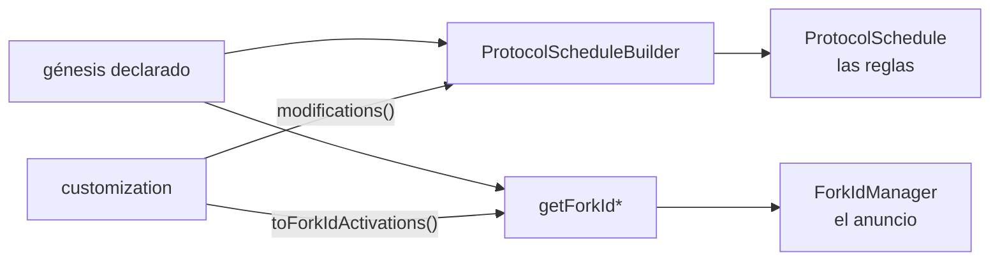
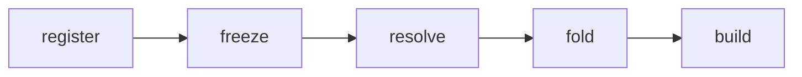

# Protocol schedule customization en Besu

El plugin de ETC trae un `classic.json`, y con ese archivo Besu arranca un nodo que corre la cadena equivocada. Donde un fork de ETC coincide con uno de ETH, el génesis usa la clave de mainnet: `byzantiumBlock: 8772000` es Atlantis, `berlinBlock: 13189133` es Magneto. Donde no coincide, usa claves propias que Besu ignora: `gothamBlock`, `ecip1041Block`, `thanosBlock`, `mystiqueBlock`, `spiralBlock`. Esta rama es el lugar donde enchufar las reglas que faltan y el anuncio que falta.

Este documento es para vos. La versión condensada para el revisor vive aparte, en `docs/upstream-pr-body.md`. Las citas del tipo `Archivo.java:120` valen contra el estado final de la rama, que es `bb20b8d442`. Doce permalinks apuntan a ese sha y dos al plugin de ETC en `e9b783799b`. Cada párrafo ocupa una línea del archivo, para que Notion lo reciba sin cortes espurios. Dónde está cada respuesta que te van a pedir en el hilo del PR:

- ¿Por qué el contrato no está en `besu-plugin-api`, y cuánto poder le da esto a un plugin? → 8.1 y 8.2
- ¿El builder esconde un bug en vez de arreglarlo? → 4 y 8.3
- ¿Por qué dos pares de accessors, y por qué no renombraste el viejo? → 3 y 8.4
- ¿Por qué la validación se invoca en el builder y no en las factories? → 5
- ¿Alcanza con preguntarle al plugin una sola vez? → 8.5
- ¿Esta rama habilita ETC, qué cubre el suite y qué falta para mergear? → 8.6, apéndice A y 8.7
- ¿Por qué tres tipos nuevos y no el mapa que Besu ya tenía? → 8.8

## 0. Un nodo de ETC que arranca mal

*Para entrar acá no hace falta nada. Es el diagnóstico del que sale todo lo demás.*

Con ese `classic.json`, el Besu de upstream arranca un nodo que hace tres cosas mal. En los forks que ETC comparte con ETH aplica las reglas de ETH, con 3 ETH de recompensa en Byzantium y bomba de dificultad. En los forks propios de ETC no cambia ninguna regla. Y les anuncia a sus peers una cadena en la que ninguno de esos forks existe.

La cadena declara un fork cuando lo pone en el génesis, y el nodo lo anuncia cuando lo mete en el fork ID de EIP-2124 que les manda a sus peers. Cada uno de esos números es un *borde*. Declarar y anunciar son dos cosas distintas, y las separo en todo el documento.

Las dos primeras fallas salen del recorrido de las reglas. Besu define un juego de claves de génesis (`homesteadBlock`, `byzantiumBlock`, `shanghaiTime`, y el resto). Un *milestone* es una altura donde Besu declara que cambian las reglas, y `MilestoneDefinitions` convierte cada clave presente en uno. Cada milestone trae un `ProtocolSpecBuilder`, el objeto mutable del que sale la `ProtocolSpec` de esa altura.

El mecanismo de consenso retoca esos builders, y los mecanismos son cuatro: Clique, BFT, merge y dificultad fija. Un *modifier* es un `UnaryOperator<ProtocolSpecBuilder>` que recibe el builder y lo devuelve retocado. A los modifiers que instalan el mecanismo de consenso los llamo *estructurales* en todo el documento. `ProtocolSpecAdapters` los tiene, `ProtocolScheduleBuilder` construye una spec por milestone, y el resultado es el `ProtocolSchedule`.

La tercera falla sale del recorrido del anuncio, con las mismas claves. `GenesisConfigOptions.getForkBlockNumbers()` y `getForkBlockTimestamps()` entregan los bordes declarados, y el `ForkIdManager` los resume en el fork ID. Ese ID viaja a tres lugares: el handshake `Status`, el ENR y `eth_config`. Los plugins no participan en ninguno de los dos recorridos, y lo que sigue es una cadena de ejemplo con la misma forma que ETC.

## 1. La cadena de ejemplo, andando

*Para entrar acá: las reglas salen de las claves de génesis, y hoy el plugin no tiene dónde meterse.*

La cadena de ejemplo declara dos milestones que Besu ya conoce: Frontier en 0 y `byzantiumBlock` en 16. Los dos son de Besu y el plugin no los toca. `MainnetProtocolSchedule` pone además un único modifier estructural, la identidad en 0, que llamo `s0`.

El plugin representa una cadena con dos forks propios que Besu no conoce, en el bloque 10 y en el 18. Ninguno cae sobre un milestone de Besu, y ese es el caso normal: si cayeran encima, Besu ya los tendría. Por cada fork el plugin aporta las reglas de la era que abre. En 10 son 42 wei de recompensa, que llamo `c10` por la altura donde entra. En 18 es la identidad, que llamo `c18`. Byzantium en 16 está en el ejemplo para ver qué le pasa a `c10` cuando Besu cambia de era en el medio.

Cada aporte del plugin es una `ProtocolSpecModification`: una activación más un modifier. La *activación* es la altura donde ese aporte entra en vigencia, 10 y 18 acá. Los dos nombres se parecen y conviene separarlos: el modifier es la función sola, y la modification es esa función con su activación. Besu nunca arma una modification para sus estructurales: se los pasa a `compose` en un mapa, con la altura de clave y sin decir en qué unidad se mide. El `s0` del ejemplo es literalmente ese mapa con una sola entrada, `Map.of(0L, Function.identity())` ([`MainnetProtocolSchedule.java:121`](https://github.com/diega/besu/blob/bb20b8d442d05e056a79028c8254535e1906b80c/ethereum/core/src/main/java/org/hyperledger/besu/ethereum/mainnet/MainnetProtocolSchedule.java#L121)). A los aportes del plugin los llamo *contribuidos* en todo el documento. Las dos modifications, más un nombre, son una `ProtocolScheduleCustomization`. Ese nombre es el de la contribución entera y no el de un fork: el plugin de ETC usa `classic`, y es lo que Besu imprime cuando la rechaza.

Una *era* es el tramo entre dos milestones, y en la cadena de ejemplo hay dos, la de Frontier y la de Byzantium. Lo que una modification escribe sobre el builder de la altura que se está construyendo es un *overlay*. Cada modification aporta el overlay completo, así que la siguiente la reemplaza en vez de sumarse a ella, y mientras tanto sigue vigente a través de los milestones que haya en el medio.

`ProtocolSpecAdapters.compose` arma tres `NavigableMap` a partir de los estructurales y de la customization (`ProtocolSpecAdapters.java:42-47`). Los tres tienen la misma forma: una altura como clave y un modifier como valor. Los estructurales ya vienen así. Cada modification se desarma al entrar: su activación pasa a ser la clave y su modifier el valor. La unidad en la que se mide esa activación decide si cae en el mapa de bloques o en el de timestamps (`:117-127`). De ahí en adelante la modification no existe: es el formato en el que el plugin declara, no lo que Besu consulta. El lookup resuelve por floor dentro de cada mapa ([`ProtocolSpecAdapters.java:132-188`](https://github.com/diega/besu/blob/bb20b8d442d05e056a79028c8254535e1906b80c/ethereum/core/src/main/java/org/hyperledger/besu/ethereum/mainnet/ProtocolSpecAdapters.java#L132-L188)), y el *floor* es la última entrada del mapa que no supera la altura que se está construyendo.

```text
getModifierForBlock(b)     = combine( floor(estructural, b), floor(customBlock, b) )
getModifierForTimestamp(t) = combine( floor(estructural, t), floor(customTimestamp, t) )

combine(s, c) = s == null ? (c == null ? identity : c)
                          : (c == null ? s : s.andThen(c))     // estructural primero, plugin después
```

Cada milestone arranca de un `ProtocolSpecBuilder` propio y sin tocar, que abajo llamo *fresco*. Cada spec sale de un builder fresco, con un modifier estructural y un overlay encima.

```text
 bloque         0            10            16            18
 milestones     Frontier ──────────────────Byzantium ─────────────────►
 estructural    s0 ────────────────────────────────────────────────────►
 del plugin                  c10 ─────────────────────── c18 ──────────►

 spec en  0  = build( s0(Frontier fresco) )                 5 ETH
 spec en 10  = build( s0.andThen(c10)(Frontier fresco) )   42 wei
 spec en 16  = build( s0.andThen(c10)(Byzantium fresco) )  42 wei
 spec en 18  = build( s0.andThen(c18)(Byzantium fresco) )   3 ETH
```

Besu no ejecuta la historia de modifications. Elige una sola por mapa, la del floor, y descarta las anteriores.

Una modification reemplaza a la anterior. Por eso `c18`, que es la identidad, devuelve la recompensa a 3 ETH en vez de heredar los 42 wei de `c10`.

El estructural y el contribuido se eligen por separado y recién después se encadenan. Por eso `c10` sobrevive al borde de Byzantium en 16, y `s0` sobrevive a los bordes del plugin.

El plugin de ETC paga esas tres reglas en la práctica ([`ClassicProtocolSpecs.java:104-134`](https://github.com/diega/besu-etc-plugin/blob/e9b783799b7b66e47bd9bcbf8fd304c7d51b4d2b/src/main/java/org/hyperledger/besu/plugins/classic/protocol/ClassicProtocolSpecs.java#L104-L134)). Agharta, Phoenix y Magneto repiten el overlay de Atlantis, porque omitirlo lo retiraría. Y los ciclos de ECIP-1017, cada 5.000.000 de bloques, viven adentro de un modifier en vez de ser modifications, porque la cadena no los anuncia como forks. En ETC a esos ciclos también les dicen eras, así que acá los llamo *ciclos de recompensa* y reservo *era* para el tramo entre milestones.

Commits `a65156acaf` y `a2456846a8`. Lo fijan `ProtocolScheduleCustomizationTest` y `ProtocolScheduleBuilderTest#aLaterModificationReplacesAnEarlierOneRatherThanInheritingIt`.

## 2. La misma declaración anuncia

*Para entrar acá: la cadena de ejemplo, donde `c10` pone 42 wei y `c18` los retira, y que todavía nadie anuncia esos bordes.*

El nodo de la cadena de ejemplo cambia de reglas en 10 y en 18, así que tiene que anunciar bordes en 10 y en 18. Esos dos números ya están declarados en las dos modifications, y el plugin no los declara de nuevo.

Para derivarlos hace falta saber si un número cuenta bloques o cuenta timestamps. A esa unidad la llamo el *dominio* de la activación, y acá viaja en el tipo. `ProtocolScheduleActivation` es una `sealed interface` con dos implementaciones, `BlockNumber` y `Timestamp`, en vez de una convención sobre un `long`. `ProtocolScheduleCustomization.toForkIdActivations()` recorre las modifications con un `switch` exhaustivo sobre ese tipo y manda cada activación a la lista de su dominio. Un dominio nuevo no compila hasta que alguien decide a qué lista va.

Ese mismo tipo reparte las modifications entre los dos mapas contribuidos del capítulo anterior, y el floor corre adentro de cada mapa sin cruzar al otro. Un bloque y un timestamp no se ordenan entre sí, y aplicar un overlay de bloque en la era de timestamps lo llevaría a alturas que su activación nunca alcanzó.

El transporte hasta el `ForkIdManager` son tres piezas. `ForkIdActivations` es el valor canónico, un record de dos listas que rechaza nulls y negativos y deja cada lista `distinct().sorted()`. `GenesisConfig.withAdditionalForkIdActivations` hace la unión con lo que ya había, muta y devuelve `this`, así que plegar dos veces la misma contribución no cambia nada. `getForkIdBlockNumbers()` y `getForkIdBlockTimestamps()` devuelven las activaciones del génesis más las del plugin, y tienen `default` en la interfaz para que ninguna otra implementación cambie.

Una sola declaración del plugin alimenta los dos recorridos que salen del génesis.



Un detalle que ETC usa: el `ForkIdManager` descarta los forks de bloque menores o iguales a 0 y los timestamps anteriores o iguales al del génesis ([`ForkIdManager.java:66-75`](https://github.com/diega/besu/blob/bb20b8d442d05e056a79028c8254535e1906b80c/ethereum/core/src/main/java/org/hyperledger/besu/ethereum/forkid/ForkIdManager.java#L66-L75)). Una modification en 0 aporta reglas y no aporta borde, y las reglas de génesis las cubre el genesis hash. El plugin de ETC se apoya en eso para su primera era.

Commits `98874f8b17` y `a65156acaf`. Lo fijan `GenesisConfigForkIdActivationsTest` y `JsonGenesisConfigOptionsTest`.

## 3. Por qué hacen falta dos pares de accessors

*Para entrar acá: hay dos pares de accessors sobre las mismas claves, y todavía nadie justificó el segundo.*

Los dos pares responden preguntas distintas. `getForkBlockNumbers()` y `getForkBlockTimestamps()` dicen qué forks declara este config con claves que Besu interpreta. `getForkIdBlockNumbers()` y `getForkIdBlockTimestamps()` dicen con qué bordes tienen que coincidir los peers. Al primer par lo llamo el *declarado* y al segundo el *anunciado*, y el anunciado es el declarado más lo contribuido.

Al declarado lo leen `MilestoneDefinitions`, merge, la validación del capítulo 5 y el propio plugin cuando decide si reclama la cadena. Al anunciado lo lee el `ForkIdManager` en sus tres instancias.

La prueba de que no alcanza con un par es merge. Para verla, la cadena de ejemplo crece: además de Frontier en 0 y `byzantiumBlock` en 16, ahora tiene `shanghaiTime: 1000`. El plugin agrega una tercera modification, la identidad en el timestamp 500.

Merge pone sus modifications de Paris en el bloque 0 y las desaplica con una identidad en el primer fork de timestamp declarado ([`MergeProtocolSchedule.java:79-84`](https://github.com/diega/besu/blob/bb20b8d442d05e056a79028c8254535e1906b80c/consensus/merge/src/main/java/org/hyperledger/besu/consensus/merge/MergeProtocolSchedule.java#L79-L84) y [`166-174`](https://github.com/diega/besu/blob/bb20b8d442d05e056a79028c8254535e1906b80c/consensus/merge/src/main/java/org/hyperledger/besu/consensus/merge/MergeProtocolSchedule.java#L166-L174)). Ese método lee el par declarado y encuentra 1000. A esa desaplicación la llamo el *corte de Paris*.

Si leyera el par anunciado encontraría 500. El corte de Paris se adelantaría a 500 y la cadena correría reglas pre-merge entre 500 y 1000. El test `aContributedTimestampDoesNotDisplaceTheParisCutoff` fija eso: en el header (bloque 100, timestamp 501) el opcode `0x44` sigue siendo `PrevRanDaoOperation`, y 500 sí aparece en `getForkIdBlockTimestamps()`. De ahí sale el principio que enuncia `bb20b8d442`: una customization se anuncia y no mueve un borde del que el schedule se construye. Ese principio solo es expresable con dos pares.

Al código productivo la composición entra por un overload nuevo en tres factories: `MainnetProtocolSchedule.fromConfig`, `FixedDifficultyProtocolSchedule.create` y `MergeProtocolSchedule.create`. Cada una llama a `ProtocolSpecAdapters.compose(susModifiers, customization)` en vez de armar los adapters sola, y las firmas viejas delegan con `none()`. El overload está marcado `@Unstable`, o sea sin garantía de compatibilidad entre versiones, y por qué eso alcanza está en 8.1.

Dificultad fija se alcanza a través de la factory de mainnet, así que el valor se propaga en esa delegación. Su estructural en 0 es `difficultyCalculator(fixed)` y se compone con el overlay del plugin en vez de ser reemplazado. Como el plugin corre después, puede sobreescribir la dificultad.

Lo que cuesta es el nombre. `getForkBlockNumbers()` ya no significa "todos los forks del nodo", y nada en el sistema de tipos impide que alguien elija el par equivocado. El Javadoc lo dice, y de ahí en más es disciplina. Hay además un desfasaje heredado. `eth_config` elige el ID por timestamp solo ([`EthConfig.java:96-97`](https://github.com/diega/besu/blob/bb20b8d442d05e056a79028c8254535e1906b80c/ethereum/api/src/main/java/org/hyperledger/besu/ethereum/api/jsonrpc/internal/methods/EthConfig.java#L96-L97)). Mientras la cabeza de una cadena como ETC está por debajo de su último fork de bloque, `eth_config` reporta el ID posterior y el handshake reporta el anterior. Es comportamiento de upstream para forks declarados y la rama no lo toca.

Commits `98874f8b17` y `e708f69ff1`. Lo fijan `MergeProtocolScheduleTest`, `MainnetProtocolScheduleTest` y `FixedProtocolScheduleTest`.

Hasta acá está la tesis, con las tres propiedades por las que upstream puede aceptar la serie. Sin un plugin que reclame la cadena, la construcción del schedule es idéntica a la de hoy, commit por commit. Besu conserva la autoridad: elige el builder de consenso, es dueño del registro y decide qué puede honrar. Y donde no puede honrar lo que le piden, el nodo no arranca. Lo que sigue es cómo funciona por dentro.

## 4. La cadena de ejemplo se rompe

*Para entrar acá: la cadena de ejemplo, y que una modification aporta el overlay completo y reemplaza a la anterior.*

La cadena vuelve a su forma del capítulo 1: Frontier en 0, `byzantiumBlock` en 16, `c10` con 42 wei, `c18` con la identidad. Ahora le agrego un segundo modifier estructural, la identidad en el bloque 20. Es una forma legal para `compose`, que es público, y para `ProtocolScheduleBuilder`, que se construye directo. `a2456846a8` la rechaza, y este capítulo es el motivo. Sin ese rechazo, una corrida puntual daba esto.

| bloque | reward | qué pasó |
|---|---|---|
| 0 | 5 ETH | base de Frontier |
| 10 | 42 wei | entra el overlay del plugin |
| 16 | 42 wei | el overlay sigue vigente en Byzantium |
| 18 | 3 ETH | `c18` retira el overlay, que es lo correcto |
| 20 | 42 wei | el overlay retirado reaparece |
| 25 | 42 wei | y persiste |

Para explicar la fila del 20 hay que abrir el builder. `ProtocolScheduleBuilder.initSchedule` arma un mapa de entradas antes de construir nada, y cada entrada dice de qué instancia de `ProtocolSpecBuilder` sale su spec. Las entradas se insertan en tres familias, en este orden (`:112-122`): primero los estructurales, después las modifications por bloque, después las modifications por timestamp. El padre de una entrada es la entrada inmediatamente anterior del mapa, o sea el `floorEntry` de su activación.

`BuilderMapEntry` expone dos accesos a esa instancia (`:381-387`). `sharedBuilder` es la instancia del milestone padre, compartida con las demás entradas que cuelgan de él. `definition` es un `Supplier` que construye una instancia nueva. Los estructurales se insertan con `parent.sharedBuilder()` (`:192`) y las contribuidas con `parent.definition().get()` (`:201`).

Cada uno tiene su motivo, y son motivos distintos. El estructural comparte porque hay comportamiento de upstream que depende de la mutación. `BaseBftProtocolScheduleBuilder.createCustomGasCalculator` (`:164-169`), cuando un fork omite `transactionGasLimit`, lee de vuelta el gas limit calculator que un modifier anterior dejó en el builder. `QbftProtocolScheduleBuilderTest#forkOmittingKeyRetainsPriorValue` (`:268`) lo fija.

La contribuida construye fresco porque el lookup le aplica exactamente un overlay a cada milestone, y los milestones siempre nacen frescos. Si compartiera, las modifications se acumularían adentro de una era y se resetearían en cada fork de Besu. Construir fresco es la única opción que se comporta igual a los dos lados de un fork de Besu.

Con los dos motivos puestos, la fila del 20 se explica sola. El estructural en 20 se inserta primero, su padre es `floorEntry(20)`, que es Byzantium en 16, y toma la misma instancia `B16` que la entrada de 16. Al construir en orden ascendente, en 16 corre `s0.andThen(c10)`, que llama a `blockReward(42)` ([`ProtocolSpecBuilder.java:126-127`](https://github.com/diega/besu/blob/bb20b8d442d05e056a79028c8254535e1906b80c/ethereum/core/src/main/java/org/hyperledger/besu/ethereum/mainnet/ProtocolSpecBuilder.java#L126-L127)), que muta el builder. En 18 una instancia fresca recibe `s0.andThen(c18)` y vuelve a 3 ETH. En 20 el modifier son dos identidades aplicadas sobre `B16`, que todavía tiene 42.

A esa forma la llamo el *alias*: una entrada estructural que cae fuera de un milestone queda como segundo poseedor de la instancia de otro. La modification posterior reemplazó el overlay en su propia entrada y no pudo alcanzar la instancia prestada. La salida adoptada es acotar lo que el plugin puede pedir y hacerlo cumplir. Con customization no vacía, `insertStructuralModifier` (`:181-191`) rechaza toda activación estructural que no sea ya una clave del mapa. A ese rechazo lo llamo la *guarda*.

La razón es exacta. Sobre una clave existente, `builders.put` reemplaza la entrada del milestone, así que la instancia compartida queda con un único poseedor. Fuera de una clave, `put` agrega el segundo poseedor, que es el alias. En el ejemplo, un estructural en 16 en vez de 20 reemplaza la entrada de Byzantium, la modification en 18 nace fresca con la `definition` propagada (`:245`), y nadie relee `B16`.

La otra salida obvia no sirve. Construir también los estructurales desde instancias frescas rompe la herencia por mutación de BFT que `forkOmittingKeyRetainsPriorValue` fija. La cura de verdad es el aislamiento completo, o sea reconstruir cada entrada desde una definición fresca replegando la cadena de estructurales hasta ella. Eso reescribe la construcción de BFT de upstream, y esta serie se presenta como sin efecto para una cadena sin plugin.

La guarda sobre-rechaza formas inofensivas, porque el alias solo hace daño si hay una modification contribuida entre el milestone padre y el estructural. Elegí el enunciado que se explica en una oración. Las tres factories habilitadas lo cumplen sin esfuerzo: mainnet y dificultad fija tienen su único estructural en 0, y merge tiene 0 más el primer fork de timestamp declarado, que es un milestone. ETC entra por la de mainnet, así que la guarda nunca lo toca.

Commit `a2456846a8`. Lo fijan `ProtocolScheduleBuilderTest#aStructuralModifierOnADeclaredMilestoneDoesNotCarryAReplacedOverlay` y `#aStructuralModifierOffADeclaredMilestoneIsRefusedAlongsideACustomization`.

## 5. Formas que el schedule no puede honrar

*Para entrar acá: el dominio de una activación, y el mapa de entradas que el builder arma antes de construir.*

De un solo hecho se deduce todo este capítulo. `DefaultProtocolSchedule` mantiene un único `TreeSet` ordenado por la magnitud del milestone, sin mirar el dominio (`:43-44`), y `getByBlockHeader` lo recorre de mayor a menor devolviendo la primera spec cuyo borde el header ya cruzó (`:68-80`). Eso funciona porque los timestamps reales son enormes y todos los forks de bloque quedan por debajo.

Un par invertido, o sea un bloque y un timestamp cuyo orden por magnitud contradice el orden por dominio, rompe esa premisa de dos maneras. Una spec de timestamp por debajo de un milestone de bloque queda tapada por él para todo header posterior a ese bloque. Y al revés: un bloque por encima del primer fork de timestamp se construye desde la definición de la era de bloques y tapa a la era de timestamps. En los dos casos la activación se anuncia en el fork ID y el nodo no la mantiene, que es lo que esta rama existe para impedir.

Hay un tercer caso, que es el mismo problema con otra forma. El builder escribe specs propias en `daoForkBlock` y `daoForkBlock + 1`, y restaura la anterior en `daoForkBlock + 10` ([`ProtocolScheduleBuilder.java:138-163`](https://github.com/diega/besu/blob/bb20b8d442d05e056a79028c8254535e1906b80c/ethereum/core/src/main/java/org/hyperledger/besu/ethereum/mainnet/ProtocolScheduleBuilder.java#L138-L163)). A ese tramo lo llamo la *ventana del DAO*. Una entrada contribuida ahí adentro o bien es pisada o bien pisa a la restauración.

De ahí salen las tres formas que `ProtocolScheduleCustomization.validateAgainst(GenesisConfigOptions)` (`ProtocolScheduleCustomization.java:94`) rechaza.

1. Un timestamp contribuido menor o igual a la última activación de bloque. Esa "última" es el máximo entre los bloques contribuidos, los declarados y `daoForkBlock + 10`, y la regla solo corre si ese máximo es mayor que 0.
2. Un bloque contribuido mayor o igual al primer fork de timestamp declarado.
3. Un bloque contribuido dentro de la ventana del DAO, extremos incluidos.

Las tres comparan un número de bloque contra un timestamp, y eso es legítimo por la misma razón por la que `validateForkOrder` ya lo hace sobre las claves de génesis. Deciden la forma del schedule y no la historia de la cadena, y es la premisa que `ForkIdManager` usa para los forks declarados, donde `getForkIdForChainHead` resuelve primero por bloque y después por timestamp (`ForkIdManager.java:89-101`).

El 10 de la ventana vive en `DAO_RECOVERY_LENGTH` (`ProtocolScheduleCustomization.java:43`) y está duplicado contra el literal `daoBlockNumber + 10` del builder, que es una deuda de mantenimiento real y conviene declararla en el PR.

La validación se invoca al comienzo de `ProtocolScheduleBuilder.initSchedule` (`:90`), al lado de `validateForkOrder`. El builder es el único punto por el que pasa todo schedule, lo construya una factory o lo construya alguien directo. `theScheduleBuilderRefusesRatherThanTheFactoriesThatCallIt` construye `ProtocolScheduleBuilder` a mano justamente para fijar dónde vive el chequeo.

La guarda del capítulo 4 no vive acá, y la diferencia importa. `validateAgainst` es una regla de la customization contra la cadena. La guarda es una precondición del algoritmo del builder, y solo el builder conoce las claves reales de su mapa. Validarla contra el config sería además incorrecto, porque `getForkBlockNumbers()` incluye `daoForkBlock`, que nunca es clave del mapa, y omite Frontier en 0.

Dos cosas no se validan a propósito. La coherencia temporal de EIP-6122, que exige que el último fork de bloque ocurra antes del tiempo del primer fork de timestamp, es incognoscible al arrancar. Y la corrección de las reglas, porque un fork ID compromete a los peers con los mismos bordes y no con las mismas reglas detrás de ellos.

Queda un residuo, y es de upstream. La restauración del DAO aplica el modifier de `floorEntry(dao)` por segunda vez sobre su `sharedBuilder` ya mutado (`:129-134` y `:144-148`). Para setters idempotentes no cambia nada, y el aislamiento completo también lo eliminaría. A ETC nada de este capítulo lo alcanza, porque `classic.json` no declara `daoForkBlock` ni claves de timestamp.

Commit `58af784e86`, más `a2456846a8` para el residuo del DAO. Lo fijan `ProtocolScheduleCustomizationValidationTest` y `ProtocolScheduleBuilderTest#theDaoRestorationKeepsWhatStructuralModifiersAccumulated`.

## 6. Del plugin al nodo

*Para entrar acá: la customization entera, o sea sus modifications, sus activaciones y las dos negativas que la validan.*

`ProtocolScheduleCustomizer` es el contrato del plugin, una interfaz funcional con `Optional<ProtocolScheduleCustomization> customize(GenesisConfigOptions)`. El plugin lo registra en su fase `register`, a través de `ProtocolScheduleService`. El customizer de ETC lee ahí el `classic.json` declarado y devuelve una sola customization. Nada de esto entra en `besu-plugin-api`, y 8.1 explica por qué.

El customizer ve el génesis declarado porque la resolución corre antes del plegado.



| paso | dónde mirar |
|---|---|
| register | `BesuPluginContextImpl:100`, el servicio se crea en el constructor |
| freeze | `BesuPluginContextImpl:184`, al terminar `registerPlugins` |
| resolve | `BesuCommand:2166-2174` llama a `ProtocolScheduleServiceImpl.resolve` (`:52`), que en [`:57`](https://github.com/diega/besu/blob/bb20b8d442d05e056a79028c8254535e1906b80c/app/src/main/java/org/hyperledger/besu/services/ProtocolScheduleServiceImpl.java#L57) congela de nuevo |
| fold | [`BesuController.java:374-388`](https://github.com/diega/besu/blob/bb20b8d442d05e056a79028c8254535e1906b80c/app/src/main/java/org/hyperledger/besu/controller/BesuController.java#L374-L388), con el comentario en [`:376-379`](https://github.com/diega/besu/blob/bb20b8d442d05e056a79028c8254535e1906b80c/app/src/main/java/org/hyperledger/besu/controller/BesuController.java#L376-L379) |
| build | `BesuControllerBuilder:1050`, `:1063`, `:1082` y `:674`, y `TransitionBesuControllerBuilder:197-206` |

El servicio es de Besu y el plugin no puede reemplazarlo. Existe desde el constructor del contexto de plugins, y `BesuPluginContextImpl.addService` rechaza pisarlo (`:117-118`). `resolve` le pregunta a todos los customizers registrados y admite cero o un resultado, y con dos falla nombrándolos en orden alfabético.

Acepta a lo sumo uno por dos razones. Fusionar dos customizations volvería significativo el orden de composición sin que nadie lo declare. Y dejar ganar al que aparece primero haría depender las reglas de consenso del orden del classpath.

La resolución se memoiza y la primera config gana. `reset()` limpia todo para el único caller que reconstruye un nodo en el mismo proceso, que es el reinicio de Ephemery (`BesuPluginContextImpl:489`). Ahí la registración vuelve a correr y los customizers del génesis anterior no deben sobrevivirla.

`BesuCommand` levanta `updateNetworkConfig(network)` a una variable y resuelve la customization contra las opciones de ese génesis, que son las declaradas porque todavía nadie aportó nada. Después `BesuController.Builder.fromGenesisFile` pliega `toForkIdActivations()` en el `GenesisConfig` antes de tomar `getConfigOptions()`. El orden importa, porque esa copia es la que el builder retiene y de la que se construye el fork ID.

Recién entonces elige el builder de consenso con esa misma copia, lo cual no cambia nada, porque `BesuController.createControllerBuilder` (`:390-443`) lee claves de consenso y TTD, y una customization no toca ninguna de las dos. De ahí el valor baja a la factory por un setter package-private.

Una cadena que migró de consenso corre con un builder de transición, que tiene una mitad para antes del corte y otra para después. `TransitionBesuControllerBuilder` propaga el mismo valor resuelto a las dos por la misma `propagateConfig` que propaga cualquier otro setting, y no se le vuelve a preguntar al plugin por cada mitad.

O el builder de consenso aplica la customization, o el nodo no arranca.

| builder elegido | con una customization no vacía |
|---|---|
| Mainnet, Merge, y Transition si sus dos mitades soportan | el nodo arranca |
| Clique, IBFT, QBFT, migración de consenso | `IllegalStateException` con el nombre de la customization y del builder |

La compuerta es `BesuControllerBuilder.verifyProtocolScheduleCustomizationIsSupported()`, `final`, invocada al principio de `build()`. Un builder se habilita sobreescribiendo `supportsProtocolScheduleCustomization()`, que por default devuelve `false`. Cuando se elige el builder, las activaciones ya están en el fork ID anunciado, así que un builder que no aplicara las reglas anunciaría bordes que no mantiene. Una cadena Clique migrada a PoS es `Transition(Clique, Merge)` y también falla, aunque la mitad merge sí soporte.

Con eso la rama tiene cinco lugares donde puede decir que no, y cada uno ya se explicó por separado. Son los constructores de los cuatro tipos nuevos, `validateAgainst`, la guarda del builder, el reclamante único de `resolve` y esta compuerta.

Commits `c7e518f56f` y `bb20b8d442`. Lo fijan `ProtocolScheduleServiceImplTest`, `BesuControllerBuilderProtocolScheduleCustomizationTest` y `TransitionBesuControllerBuilderTest`.

## 7. Los siete commits

*Para entrar acá: todo lo anterior. Este capítulo dice en qué commit entra cada cosa, y por qué van separados.*

Cada commit compila solo y es un no-op para una cadena sin plugin. Esa es la propiedad con la que le pedís a upstream que revise siete commits en vez de auditar ETC, y recién el séptimo hace que una contribución de plugin afecte a un nodo. Ninguno de los siete nombra a ETC.

| # | sha | mensaje | qué introduce | por qué va solo | cap. |
|---|---|---|---|---|---|
| 1 | `98874f8b17` | refactor: let the genesis config carry additional EIP-2124 fork activations | `ForkIdActivations`, el fold y el par `getForkId*` | refactor de `config`, sin tipos nuevos | 2, 3 |
| 2 | `a65156acaf` | feat: add typed protocol-schedule activations and modifications | los tres tipos del vocabulario y `toForkIdActivations()` | el contrato existe y nadie lo lee | 1, 2 |
| 3 | `a2456846a8` | feat: compose contributed modifications into the protocol schedule | `compose`, las tres familias, `sharedBuilder` y `definition`, la guarda | compone y nadie lo invoca | 1, 4 |
| 4 | `58af784e86` | feat: refuse customizations whose activations the schedule cannot honor | `validateAgainst` y su invocación en `initSchedule` | qué formas son honrables es otra pregunta | 5 |
| 5 | `e708f69ff1` | feat: let the schedule factories take a customization | el overload de las tres factories | solo firmas, sin caller | 3 |
| 6 | `c7e518f56f` | feat: add a Besu-owned registry for protocol-schedule customizers | el contrato del plugin y el registro | descubrimiento y autoridad, sin construcción | 6 |
| 7 | `bb20b8d442` | feat: resolve the customization when building a node, or refuse to start | resolución, fold en el controller, compuerta, CHANGELOG | cierra el circuito | 6 |

Base `b330564a94`, un commit real de upstream/main. Diff de 38 archivos, +2394/−69, repartidos en 1194 líneas de producción, 1199 de tests y 1 de CHANGELOG. Escribí esto leyendo el diff completo, los mensajes de commit, los tests, el código preexistente del que el diseño depende y el plugin de ETC que lo consume. Los suites de cada módulo están escritos por commit y no corrí ninguno completo. La tabla de recompensas del capítulo 4 sale de una corrida puntual con la guarda desactivada.

## 8. Lo que te van a preguntar en la revisión

*Para entrar acá: el alias del capítulo 4, el corte de Paris del 3 y la negativa a arrancar del 6.*

### 8.1 "¿Por qué el punto de extensión está en `ethereum/core` y no en `plugin-api`?"

Porque `plugin-api` no depende de `:ethereum:core`, así que `UnaryOperator<ProtocolSpecBuilder>` ni siquiera es expresable ahí. Poner solo la interfaz en `plugin-api` no eliminaría la dependencia, la escondería detrás de una firma que sigue exponiendo internals. [`ProtocolScheduleCustomizer.java:23-31`](https://github.com/diega/besu/blob/bb20b8d442d05e056a79028c8254535e1906b80c/ethereum/core/src/main/java/org/hyperledger/besu/ethereum/mainnet/ProtocolScheduleCustomizer.java#L23-L31) lo dice explícitamente. El contrato queda en `ethereum/core` marcado `@Unstable`, y el lifecycle en `app`.

El precio lo paga el plugin, y ya lo está pagando. [`ClassicProtocolSpecs.java:193-196`](https://github.com/diega/besu-etc-plugin/blob/e9b783799b7b66e47bd9bcbf8fd304c7d51b4d2b/src/main/java/org/hyperledger/besu/plugins/classic/protocol/ClassicProtocolSpecs.java#L193-L196) cuenta que tuvo que reinstalar en cada era los validadores de header PoW que upstream retiró de las specs de mainnet. `@Unstable` comunica esa condición y no ofrece aislamiento ni compatibilidad binaria.

### 8.2 "¿Qué tan amplio es el poder que le das al plugin?"

Amplio, y ese es el riesgo mayor de toda la rama. El overlay corre después del estructural, así que puede sobreescribir decisiones de consenso instaladas antes. El test de merge que cambia la recompensa post-merge y conserva `PREVRANDAO` demuestra composición, y también autoridad real sobre las reglas. El riesgo de fondo es de gobernanza: que upstream acepte exponer `ProtocolSpecBuilder` a plugins, aunque sea `@Unstable`. El diseño lo acota con un solo reclamante, validación central y negativa a arrancar. Eso es lo que hay que defender.

### 8.3 "¿La guarda del builder arregla el alias o lo tapa?"

Lo tapa, y está dicho así a propósito. El modelo de dos instancias sigue teniendo el alias latente y la guarda lo vuelve inalcanzable. La cura es el aislamiento completo del capítulo 4, y lo va a forzar el primero que necesite BFT o Clique con customization. Eso tiene que quedar registrado como seguimiento en el PR.

### 8.4 "¿Por qué no renombraste `getForkBlockNumbers()`?"

Por churn sobre todos los call sites de upstream. El costo está en el capítulo 3 y es real: el nombre quedó menos específico que su semántica. Es el punto donde un revisor puede pedir el rename, y no tengo un argumento en contra más allá del costo.

### 8.5 "¿Alcanza con resolver una vez?"

Resolver una vez no es ejecutar una vez. Los modifiers corren por cada milestone y por cada mitad de una transición. Por eso el contrato exige que el customizer sea determinista y sin efectos, y el plugin de ETC reutiliza una instancia de overlay por era. Cualquier estado adentro de un modifier es un bug esperando.

Una era contribuida tampoco tiene identidad propia. Su `hardforkId` es el del milestone padre (`ProtocolScheduleBuilder.insertModifier`, `:242`) salvo que el modifier lo cambie, y `listMilestones()` la lista bajo ese nombre. Para ETC, que no usa engine API, es cosmético. Para otra cadena podría no serlo.

### 8.6 "¿Esta rama habilita ETC?"

No sola. El plugin lee sus claves propias con `GenesisConfigOptions.getCustomConfigLong`, que no está acá ni en upstream, y vive en otras ramas de la serie (`feat/genesis-custom-config-long` y `etc-integration`). Tampoco hay en este diff un test integral desde un plugin registrado hasta un nodo arrancado. La evidencia es por partes.

### 8.7 "¿Qué falta para mergear?"

Una sola cosa bloquea el merge. La entrada de CHANGELOG que agrega `bb20b8d442` termina con un placeholder sin resolver, `[#NNNN](https://github.com/besu-eth/besu/pull/NNNN)`, y hay que completar el número una vez abierto el PR.

Aparte de eso quedan dos pedidos que no bloquean. Conviene que esa misma entrada nombre `getForkIdBlockNumbers()` y `getForkIdBlockTimestamps()`, que hoy no menciona. Y conviene dejar escrito el seguimiento del aislamiento completo de 8.3.

### 8.8 "¿Por qué tres tipos nuevos y no el mapa que ya existe?"

Porque el mapa no puede decir el dominio. A Besu le alcanza con un `long` pelado porque sus estructurales caen sobre un milestone y heredan de él si cuenta bloques o timestamps. Una activación contribuida puede caer entre milestones, donde no hay de quién heredar, y `toForkIdActivations()` tiene que saber a cuál de las dos listas mandarla. El `sealed interface` con `BlockNumber` y `Timestamp` es el mínimo para expresar eso, y el `switch` exhaustivo hace que un dominio nuevo no compile hasta que alguien decida dónde va.

Lo discutible es lo otro: que los estructurales no se hayan migrado al tipo nuevo. Es deliberado, y es lo que deja la asimetría que describe el capítulo 1. Convertirlos tocaría todos los builders de consenso y costaría la propiedad sobre la que se apoya la serie entera, que cada commit sea un no-op para una cadena sin plugin.

## Apéndice A. Qué cubre el suite

*Para entrar acá no hace falta nada. Es la respuesta a qué cubre exactamente la serie.*

El diff toca trece archivos de test y suma 1199 líneas. La tabla lista los once que cubren algo nuevo, más `QbftProtocolScheduleBuilderTest`, que es preexistente y no está en el diff. Los otros dos, `RunnerBuilderTest` y `CommandTestAbstract`, solo ajustan firmas.

| clase | qué cubre |
|---|---|
| `GenesisConfigForkIdActivationsTest`, `JsonGenesisConfigOptionsTest` | dos activaciones extra dan dos fork IDs más, una activación futura cambia `FORK_NEXT` sin tocar el hash de forks ya cruzados, y la lista declarada queda separada de la anunciada |
| `ProtocolScheduleCustomizationTest` | orden estructural y después plugin, vigencia cruzada a través de los bordes del otro, y que un overlay de bloque no llega a la era de timestamps |
| `ProtocolScheduleBuilderTest` | reemplazo en vez de herencia, la guarda del estructural fuera de milestone, el caso que sí acepta, y la restauración del DAO |
| `ProtocolScheduleCustomizationValidationTest` | las tres formas rechazadas, los tres extremos del DAO, el bloque inmediatamente posterior, y dónde vive el chequeo |
| `MainnetProtocolScheduleTest`, `FixedProtocolScheduleTest` | floor con 1, 16 y 100, que sin customization el schedule es el de siempre, y reward contribuido conviviendo con dificultad fija |
| `MergeProtocolScheduleTest` | el corte de Paris intacto, y reward post-merge conservando `PREVRANDAO` |
| `ProtocolScheduleServiceImplTest` | evaluación única y memoizada, rechazo de dos reclamantes, freeze por los dos lados, servicio irreemplazable, reset de Ephemery |
| `BesuControllerBuilderProtocolScheduleCustomizationTest` | lo contribuido llega a `getForkId*` y no a `getFork*`, y Clique rechaza nombrando customization y builder |
| `TransitionBesuControllerBuilderTest` | la misma instancia llega a las dos mitades, y la transición soporta solo si ambas lo hacen |
| `QbftProtocolScheduleBuilderTest` | `forkOmittingKeyRetainsPriorValue`, preexistente, que es lo que obliga al `sharedBuilder` |

## Apéndice B. Dónde vive cada pieza

*Para entrar acá no hace falta nada. Es dónde buscar una clase dentro de dos meses.*

| pieza | módulo | capítulo |
|---|---|---|
| `ForkIdActivations`, `GenesisConfig.withAdditionalForkIdActivations`, `getForkId*` | `config` | 2 |
| `ProtocolScheduleActivation`, `ProtocolSpecModification`, `ProtocolScheduleCustomization` | `ethereum/core` | 1, 2, 5 |
| `ProtocolSpecAdapters.compose`, `ProtocolScheduleBuilder` | `ethereum/core` | 1, 4, 5 |
| `MainnetProtocolSchedule`, `FixedDifficultyProtocolSchedule`, `MergeProtocolSchedule` | `ethereum/core`, `consensus/merge` | 3 |
| `ProtocolScheduleCustomizer`, `ProtocolScheduleService` | `ethereum/core` | 6 |
| `ProtocolScheduleServiceImpl`, `BesuPluginContextImpl`, `BesuCommand`, `BesuControllerBuilder` | `app` | 6 |
